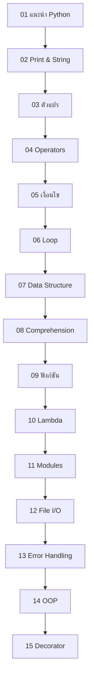

## Python คืออะไร?

**Python** เป็นภาษาโปรแกรมมิ่งระดับสูง (High-level Programming Language) ที่ถูกสร้างขึ้นโดย **Guido van Rossum** และเปิดตัวครั้งแรกในปี **1991**

ชื่อ Python ไม่ได้มาจากงู แต่มาจากรายการตลก **Monty Python's Flying Circus** ที่ Guido ชื่นชอบ

Python ได้รับความนิยมอย่างมากเพราะ:

- **อ่านง่าย เขียนง่าย** — ไวยากรณ์ใกล้เคียงภาษาอังกฤษ
- **Community ใหญ่มาก** — มี library และ framework มากกว่า 400,000+ ตัวบน PyPI
- **ใช้ได้หลากหลาย** — ตั้งแต่เว็บไซต์ไปจนถึง AI
- **เริ่มต้นได้ทันที** — ไม่ต้องตั้งค่าซับซ้อน

## ธรรมชาติของ Python

Python มีลักษณะเฉพาะที่ทำให้แตกต่างจากภาษาอื่น:

### 1. Interpreted Language (ภาษาแปลทีละบรรทัด)

Python ไม่ต้อง compile ก่อนรัน เหมือนคุยกับคอมพิวเตอร์ทีละประโยค ได้ผลลัพธ์ทันที

<CodeRunner code={`# Python รันทีละบรรทัด ได้ผลทันที
print("บรรทัดที่ 1")
print("บรรทัดที่ 2")
print(1 + 2)`} />

### 2. Dynamic Typing (ไม่ต้องบอกชนิดข้อมูลล่วงหน้า)

ไม่ต้องประกาศชนิดข้อมูลเหมือนภาษา C หรือ Java — Python รู้เองจากค่าที่ใส่

<CodeRunner code={`x = 10          # Python รู้ว่า x เป็นตัวเลข
x = "สวัสดี"    # เปลี่ยนเป็นข้อความก็ได้เลย
print(x)
print(type(x))`} />

### 3. Indentation-based (เว้นวรรคคือชีวิต)

Python ใช้การ **เว้นวรรค** (indentation) ในการกำหนดโครงสร้างของโค้ด แทนที่จะใช้ `{}` เหมือนภาษาอื่น

<CodeRunner code={`# ถูกต้อง — เว้น 4 ช่องว่าง
if True:
    print("เว้นวรรคถูกต้อง")

# ลองรันดูจะเห็นว่ามันทำงานได้ปกติ
for i in range(3):
    print(f"รอบที่ {i + 1}")`} />

### 4. Everything is an Object (ทุกอย่างคือ Object)

ใน Python ทุกอย่างเป็น object — ตัวเลข, ข้อความ, ฟังก์ชัน, แม้แต่ `True/False`

<CodeRunner code={`# แม้แต่ตัวเลขก็เป็น object ที่มี method
print("hello".upper())
print(type(42))
print(type(True))
print(type(print))`} />

## Python ใช้ทำอะไรได้บ้าง?

| สาขา | ตัวอย่างการใช้งาน | Library ที่นิยม |
|---|---|---|
| **Web Development** | สร้างเว็บไซต์, API | Django, Flask, FastAPI |
| **Data Science** | วิเคราะห์ข้อมูล, สร้างกราฟ | Pandas, NumPy, Matplotlib |
| **AI / Machine Learning** | สร้างโมเดล AI, Deep Learning | TensorFlow, PyTorch, Scikit-learn |
| **Automation** | ทำงานอัตโนมัติ, Bot | Selenium, Requests, BeautifulSoup |
| **Game Development** | สร้างเกม 2D | Pygame |

## Hello, World!

มาลองเขียนโปรแกรม Python แรกของเรากัน:

<CodeRunner code={`print("Hello, World!")
print("สวัสดีชาว Python!")
print("ยินดีต้อนรับสู่ mixPie DEV 🐍")`} />

## เส้นทางการเรียนรู้

```mermaid
flowchart TB
    A["01 แนะนำ Python"] --> B["02 Print & String"]
    B --> C["03 ตัวแปร"]
    C --> D["04 Operators"]
    D --> E["05 เงื่อนไข"]
    E --> F["06 Loop"]
    F --> G["07 Data Structure"]
    G --> H["08 Comprehension"]
    H --> I["09 ฟังก์ชัน"]
    I --> J["10 Lambda"]
    J --> K["11 Modules"]
    K --> L["12 File I/O"]
    L --> M["13 Error Handling"]
    M --> N["14 OOP"]
    N --> O["15 Decorator"]
```

## สรุป

- Python เป็นภาษา **Interpreted**, **Dynamic Typing**, ใช้ **Indentation**
- ทุกอย่างใน Python เป็น **Object**
- ใช้ได้หลากหลายตั้งแต่ Web, Data, AI ไปจนถึง Automation
- เริ่มต้นง่ายด้วย `print("Hello, World!")`

บทต่อไป: **คำสั่ง Print และ Strings** — เจาะลึกการแสดงผลและจัดการข้อความ
