## Python คืออะไร?

**Python** เป็นภาษาโปรแกรมมิ่งระดับสูงที่ออกแบบมาให้อ่านง่ายและเขียนง่าย
เหมาะสำหรับผู้เริ่มต้นและยังทรงพลังพอสำหรับมืออาชีพ

เหตุผลที่ Python ได้รับความนิยม:

- **อ่านง่าย** — ไวยากรณ์ใกล้เคียงภาษาอังกฤษ
- **ใช้ได้หลายด้าน** — Web, Data Science, AI, Automation
- **Community ใหญ่** — มี library และ framework มากมาย
- **เริ่มต้นได้เร็ว** — ไม่ต้องตั้งค่าซับซ้อน

## Hello, World!

โค้ด Python ที่ง่ายที่สุดคือการแสดงผลข้อความ:

<CodeRunner code={`print("Hello, World!")
print("สวัสดีชาว Python!")
print("ยินดีต้อนรับสู่การเขียนโปรแกรม 🎉")`} />

## ตัวแปรและชนิดข้อมูล

ตัวแปรใน Python ไม่ต้องประกาศชนิดข้อมูลล่วงหน้า:

<CodeRunner code={`# ตัวเลขจำนวนเต็ม (int)
age = 25
print("อายุ:", age)

# ตัวเลขทศนิยม (float)
gpa = 3.75
print("เกรดเฉลี่ย:", gpa)

# ข้อความ (str)
name = "ไพธอน"
print("ชื่อ:", name)

# ตรรกะ (bool)
is_student = True
print("เป็นนักเรียน:", is_student)

# ตรวจสอบชนิดข้อมูล
print(type(age), type(gpa), type(name))`} />

## การคำนวณเบื้องต้น

Python รองรับการคำนวณทางคณิตศาสตร์ครบถ้วน:

<CodeRunner code={`a = 10
b = 3

print("บวก:", a + b)      # 13
print("ลบ:", a - b)       # 7
print("คูณ:", a * b)      # 30
print("หาร:", a / b)      # 3.333...
print("หารเอาจำนวนเต็ม:", a // b)  # 3
print("เศษ:", a % b)      # 1
print("ยกกำลัง:", a ** b) # 1000

# คำนวณพื้นที่วงกลม
import math
radius = 7
area = math.pi * radius ** 2
print(f"พื้นที่วงกลม รัศมี {radius} = {area:.2f}")`} />

## เส้นทางการเรียนรู้

```mermaid
flowchart LR
  A["พื้นฐาน Python"] --> B["ตัวแปร & ชนิดข้อมูล"]
  B --> C["เงื่อนไข & ลูป"]
  C --> D["ฟังก์ชัน"]
  D --> E["List & Dict"]
  E --> F["โปรเจกต์จริง"]
```

## สรุป

ในบทนี้คุณได้เรียนรู้:

- การใช้ `print()` เพื่อแสดงผล
- ชนิดข้อมูลพื้นฐาน: `int`, `float`, `str`, `bool`
- การคำนวณทางคณิตศาสตร์

บทต่อไป: **ตัวแปรและสตริง** — เจาะลึกการจัดการข้อความ
