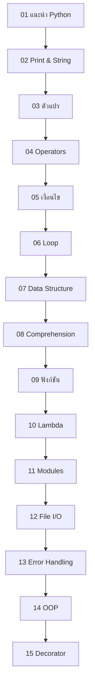

# Python Course Content — 15 Lessons Implementation Plan

> **For agentic workers:** REQUIRED SUB-SKILL: Use superpowers:subagent-driven-development (recommended) or superpowers:executing-plans to implement this plan task-by-task. Steps use checkbox (`- [ ]`) syntax for tracking.

**Goal:** Convert the Jupyter notebook `my_learing_mat/1. Hello_python.ipynb` (352 cells) into 15 comprehensive MDX lesson files for the mixPie DEV Thai-language Python learning platform, supplemented with additional topics not covered in the notebook.

**Architecture:** Each lesson is a standalone `.mdx` file in `content/basic/` with Thai prose, runnable `<CodeRunner>` blocks, images, and Mermaid diagrams. Content flows from beginner (print) to advanced (decorators). The MDX files are read at build time via `lib/mdx.ts` and compiled with `next-mdx-remote`.

**Tech Stack:** Next.js 16, MDX (`next-mdx-remote`), `<CodeRunner>` component (Pyodide), Mermaid diagrams, CodeMirror editor

---

## Important Notes for Implementers

### MDX Format Pattern

Every MDX file follows this structure:
```mdx
---
title: "ชื่อบท"
description: "คำอธิบายสั้นๆ"
category: "basic"
order: N
tags: ["tag1", "tag2"]
---

## หัวข้อ

คำอธิบายภาษาไทย

<CodeRunner code={`python_code_here`} />


```

### CodeRunner Component

The `<CodeRunner>` component accepts a `code` prop with a template literal. **Important:** The component interface currently defines `initialCode` but all existing MDX uses `code`. Task 0 fixes this mismatch.

### Content Extraction

Notebook cells are referenced by index. Use this Python snippet to extract full cell content:
```python
import json
with open('my_learing_mat/1. Hello_python.ipynb', 'r', encoding='utf-8') as f:
    nb = json.load(f)
cell_source = ''.join(nb['cells'][CELL_INDEX]['source'])
```

### Notebook Section → Lesson Mapping

| Notebook Section | Cells | Target Lesson |
|---|---|---|
| (none — write from scratch) | — | `01-intro.mdx` |
| Print Statement | 1-37 | `02-print.mdx` |
| Variable ตัวแปร | 38-81 | `03-variables.mdx` |
| Operation | 179-208 | `04-operations.mdx` |
| Conditional Statements | 209-246 | `05-conditions.mdx` |
| For Loop And While Loop | 273-335 | `06-loops.mdx` |
| Data Structure | 82-178 | `07-data-structures.mdx` |
| (none — write from scratch) | — | `08-comprehensions.mdx` |
| Function | 247-272 | `09-functions.mdx` |
| (none — write from scratch) | — | `10-lambda.mdx` |
| (none — write from scratch) | — | `11-modules.mdx` |
| (none — write from scratch) | — | `12-file-io.mdx` |
| (none — write from scratch) | — | `13-error-handling.mdx` |
| Class and OOP | 336-338 | `14-oop.mdx` |
| Decorator ใน Python | 339-351 | `15-decorators.mdx` |

### Available Images

```
public/images/lessons/
├── variables/
│   ├── python-data-types.webp       # Python data types hierarchy
│   ├── legb-scope.png               # LEGB scope diagram (from notebook)
│   ├── legb-scope-gfg.png           # LEGB scope (GeeksforGeeks)
│   ├── variable-reference-1.png     # Variable reference model
│   └── variable-reference-2.png     # Variable reassignment model
├── data-structures/
│   ├── list-index.png               # List indexing (from notebook)
│   ├── list-index-programiz.png     # List indexing (Programiz)
│   ├── list-negative-index.png      # Negative indexing
│   ├── dict-structure.webp          # Dictionary key-value
│   └── set-operations.png           # Set union/intersection (from notebook)
├── loops/
│   ├── for-loop-flowchart.png       # For loop flowchart
│   └── while-loop-flowchart.png     # While loop flowchart
├── error-handling/
│   └── try-except-flow.png          # Try/except flow diagram
├── file-io/
│   ├── file-open.png                # File open diagram
│   └── file-write.png               # File write diagram
└── oop/
    ├── inheritance-example.png      # Basic inheritance
    ├── multiple-inheritance.png     # Multiple inheritance
    └── multilevel-inheritance.png   # Multilevel inheritance
```

---

## Task 0: Setup — Clean Old Files & Fix CodeRunner Prop

**Files:**
- Delete: `content/basic/01-intro.mdx`, `content/basic/02-variables.mdx`, `content/basic/03-conditions.mdx`
- Delete: `content/01-intro.mdx` (orphaned file in content root)
- Modify: `components/mdx/CodeRunner.tsx`

- [ ] **Step 1: Delete old MDX files**

```bash
rm content/basic/01-intro.mdx content/basic/02-variables.mdx content/basic/03-conditions.mdx
rm -f content/01-intro.mdx
```

- [ ] **Step 2: Fix CodeRunner prop name**

In `components/mdx/CodeRunner.tsx`, change the prop from `initialCode` to `code` to match all MDX usage:

```tsx
// Change this:
interface CodeRunnerProps {
  initialCode?: string;
}
export default function CodeRunner({ initialCode = "" }: CodeRunnerProps) {
  const [code, setCode] = useState(initialCode);

// To this:
interface CodeRunnerProps {
  code?: string;
}
export default function CodeRunner({ code: initialCode = "" }: CodeRunnerProps) {
  const [code, setCode] = useState(initialCode);
```

- [ ] **Step 3: Verify build**

```bash
npm run build
```

Expected: Build succeeds with no TypeScript errors.

- [ ] **Step 4: Commit**

```bash
git add -A
git commit -m "chore: clean old MDX files and fix CodeRunner prop name"
```

---

## Task 1: Create `01-intro.mdx` — แนะนำภาษา Python

**Files:**
- Create: `content/basic/01-intro.mdx`

**Source:** Written from scratch (no notebook cells)

**Sections:**
1. Python คืออะไร? — ประวัติ, Guido van Rossum, ภาษา interpreted
2. ทำไมถึงเลือก Python — อ่านง่าย, community, ใช้ได้หลากหลาย
3. ธรรมชาติของ Python — Interpreted, Dynamic Typing, Indentation-based, Everything is Object
4. Python ใช้ทำอะไรได้บ้าง — Web, Data Science, AI/ML, Automation, Game
5. Hello World — ตัวอย่างแรก
6. Mermaid: เส้นทางการเรียนรู้ 15 บท

**Images:** None (use Mermaid for learning path diagram)

- [ ] **Step 1: Create the MDX file**

Write to `content/basic/01-intro.mdx`:

```mdx
---
title: "แนะนำภาษา Python"
description: "ทำความรู้จัก Python ตั้งแต่ประวัติ ธรรมชาติของภาษา ไปจนถึงเหตุผลที่ Python เป็นภาษาที่ดีที่สุดสำหรับผู้เริ่มต้น"
category: "basic"
order: 1
tags: ["intro", "beginner"]
---

## Python คืออะไร?

**Python** เป็นภาษาโปรแกรมมิ่งระดับสูง (High-level Programming Language) ที่ถูกสร้างขึ้นโดย **Guido van Rossum** และเปิดตัวครั้งแรกในปี **1991**

ชื่อ Python ไม่ได้มาจากงู แต่มาจากรายการตลก **Monty Python's Flying Circus** ที่ Guido ชื่นชอบ

Python ได้รับความนิยมอย่างมากเพราะ:

- **อ่านง่าย เขียนง่าย** — ไวยากรณ์ใกล้เคียงภาษาอังกฤษ
- **Community ใหญ่มาก** — มี library และ framework มากกว่า 400,000+ ตัวบน PyPI
- **ใช้ได้หลากหลาย** — ตั้งแต่เว็บไซต์ไปจนถึง AI
- **เริ่มต้นได้ทันที** — ไม่ต้องตั้งค่าซับซ้อน

## ธรรมชาติของ Python

Python มีลักษณะเฉพาะที่ทำให้แตกต่างจากภาษาอื่น:

### 1. Interpreted Language (ภาษาแปลทีละบรรทัด)

Python ไม่ต้อง compile ก่อนรัน เหมือนคุยกับคอมพิวเตอร์ทีละประโยค ได้ผลลัพธ์ทันที

<CodeRunner code={`# Python รันทีละบรรทัด ได้ผลทันที
print("บรรทัดที่ 1")
print("บรรทัดที่ 2")
print(1 + 2)`} />

### 2. Dynamic Typing (ไม่ต้องบอกชนิดข้อมูลล่วงหน้า)

ไม่ต้องประกาศชนิดข้อมูลเหมือนภาษา C หรือ Java — Python รู้เองจากค่าที่ใส่

<CodeRunner code={`x = 10          # Python รู้ว่า x เป็นตัวเลข
x = "สวัสดี"    # เปลี่ยนเป็นข้อความก็ได้เลย
print(x)
print(type(x))`} />

### 3. Indentation-based (เว้นวรรคคือชีวิต)

Python ใช้การ **เว้นวรรค** (indentation) ในการกำหนดโครงสร้างของโค้ด แทนที่จะใช้ `{}` เหมือนภาษาอื่น

<CodeRunner code={`# ถูกต้อง — เว้น 4 ช่องว่าง
if True:
    print("เว้นวรรคถูกต้อง")

# ลองรันดูจะเห็นว่ามันทำงานได้ปกติ
for i in range(3):
    print(f"รอบที่ {i + 1}")`} />

### 4. Everything is an Object (ทุกอย่างคือ Object)

ใน Python ทุกอย่างเป็น object — ตัวเลข, ข้อความ, ฟังก์ชัน, แม้แต่ `True/False`

<CodeRunner code={`# แม้แต่ตัวเลขก็เป็น object ที่มี method
print((255).to_bytes(2, 'big'))
print("hello".upper())
print(type(42))
print(type(True))`} />

## Python ใช้ทำอะไรได้บ้าง?

| สาขา | ตัวอย่างการใช้งาน | Library ที่นิยม |
|---|---|---|
| **Web Development** | สร้างเว็บไซต์, API | Django, Flask, FastAPI |
| **Data Science** | วิเคราะห์ข้อมูล, สร้างกราฟ | Pandas, NumPy, Matplotlib |
| **AI / Machine Learning** | สร้างโมเดล AI, Deep Learning | TensorFlow, PyTorch, Scikit-learn |
| **Automation** | ทำงานอัตโนมัติ, Bot | Selenium, Requests, BeautifulSoup |
| **Game Development** | สร้างเกม 2D | Pygame |

## Hello, World!

มาลองเขียนโปรแกรม Python แรกของเรากัน:

<CodeRunner code={`print("Hello, World!")
print("สวัสดีชาว Python!")
print("ยินดีต้อนรับสู่ mixPie DEV 🐍")`} />

## เส้นทางการเรียนรู้



## สรุป

- Python เป็นภาษา **Interpreted**, **Dynamic Typing**, ใช้ **Indentation**
- ทุกอย่างใน Python เป็น **Object**
- ใช้ได้หลากหลายตั้งแต่ Web, Data, AI ไปจนถึง Automation
- เริ่มต้นง่ายด้วย `print("Hello, World!")`

บทต่อไป: **คำสั่ง Print และ Strings** — เจาะลึกการแสดงผลและจัดการข้อความ
```

- [ ] **Step 2: Verify build**

```bash
npm run build
```

Expected: Build succeeds.

- [ ] **Step 3: Commit**

```bash
git add content/basic/01-intro.mdx
git commit -m "feat: add lesson 01 - Python introduction"
```

---

## Task 2: Create `02-print.mdx` — คำสั่ง Print และ Strings

**Files:**
- Create: `content/basic/02-print.mdx`

**Source:** Notebook cells 1-37 (Print Statement section)

**Sections:**
1. `print()` พื้นฐาน — แสดงข้อความ, หลายค่าด้วย `,`
2. `sep` parameter — เปลี่ยนตัวคั่น
3. f-string — การแทรกตัวแปร
4. Modify Strings — `upper()`, `lower()`, `strip()`, `replace()`, `split()`, `join()`
5. การเว้นบรรทัด — `\n`, `end=""`, `\r`, `\t`
6. Escape characters — `\\`, `\'`, `\"`
7. Raw strings — `r"..."` (เพิ่มเติมจาก notebook)
8. Multiline strings — `"""..."""` (เพิ่มเติมจาก notebook)

- [ ] **Step 1: Extract content from notebook cells 1-37 and create MDX**

Write to `content/basic/02-print.mdx`:

```mdx
---
title: "คำสั่ง Print และ Strings"
description: "เรียนรู้การแสดงผลด้วย print() การจัดการข้อความ f-string และเทคนิคการจัดรูปแบบ"
category: "basic"
order: 2
tags: ["print", "string", "f-string", "beginner"]
---

## คำสั่ง `print()`

`print()` เป็นคำสั่งสำหรับการแสดงผลค่าต่างๆ ในภาษา Python ไม่ว่าจะเป็นข้อความ ตัวแปร ตัวเลข หรือแม้แต่ค่าที่ได้จากฟังก์ชัน

<CodeRunner code={`print("ข้อความอะไรก็ได้")`} />

### แสดงผลหลายค่าด้วย `,`

ถ้าเว้นข้อมูลด้วย `,` จะเป็นการเว้นวรรคโดยอัตโนมัติ

<CodeRunner code={`print("ข้อความ 1", "ข้อความ 2")
print("สวัสดี", "ชาว", "Python")`} />

### เปลี่ยนตัวคั่นด้วย `sep`

<CodeRunner code={`print("ข้อความ 1", "ข้อความ 2", sep="")
print("2024", "01", "15", sep="-")
print("A", "B", "C", sep=" -> ")`} />

### แสดงผลตัวแปร

<CodeRunner code={`a = 15
b = 16
print(a, b)
print("ค่าของ a คือ", a)`} />

## f-string — การแทรกตัวแปรในข้อความ

ใน Python สมัยใหม่ เราใช้ `f-string` ภายใน `print()` เพื่อแทรกตัวแปรลงในข้อความ โดยใช้เครื่องหมายวงเล็บปีกกา `{}`

<CodeRunner code={`age = 16
name = "Ram"
print(f"My name is {name} and I am {age} years old.")
print(f"{name} is {age} years old. {age} is my favorite number.")`} />

### จัดรูปแบบตัวเลขใน f-string

<CodeRunner code={`pi = 3.14159265
print(f"π ≈ {pi:.2f}")         # ทศนิยม 2 ตำแหน่ง
print(f"π ≈ {pi:.4f}")         # ทศนิยม 4 ตำแหน่ง

price = 1500000
print(f"ราคา: {price:,} บาท")  # ใส่ comma คั่นหลักพัน

score = 95
print(f"คะแนน: {score:>10}")   # ชิดขวา 10 ตำแหน่ง
print(f"คะแนน: {score:<10}!")  # ชิดซ้าย 10 ตำแหน่ง`} />

## Modify Strings — การปรับแต่งสตริง

Python มี method สำเร็จรูปสำหรับจัดการสตริง:

### `upper()` และ `lower()`

<CodeRunner code={`text = "hello world"
print(text.upper())   # HELLO WORLD

text2 = "HELLO WORLD"
print(text2.lower())  # hello world`} />

### `strip()` — ลบช่องว่าง

<CodeRunner code={`text = "   Hello World   "
print(text.strip())    # ลบทั้งหน้าและหลัง
print(text.lstrip())   # ลบเฉพาะด้านซ้าย
print(text.rstrip())   # ลบเฉพาะด้านขวา`} />

### `replace()` — แทนที่ข้อความ

<CodeRunner code={`text = "I like apples"
result = text.replace("apples", "bananas")
print(result)`} />

### `split()` — แบ่งข้อความเป็น list

<CodeRunner code={`text = "apple,banana,cherry"
result = text.split(",")
print(result)

text2 = "Hello World Python"
result2 = text2.split(" ")
print(result2)`} />

### `join()` — รวม list เป็นข้อความ (ตรงข้ามกับ split)

<CodeRunner code={`fruits = ["apple", "banana", "cherry"]
result = ", ".join(fruits)
print(result)

words = ["Hello", "World"]
print(" ".join(words))
print("-".join(["2024", "01", "15"]))`} />

### `find()` และ `startswith()` / `endswith()`

<CodeRunner code={`text = "Hello Python World"
print(text.find("Python"))       # หาตำแหน่ง → 6
print(text.find("Java"))         # หาไม่เจอ → -1
print(text.startswith("Hello"))  # True
print(text.endswith("World"))    # True`} />

## การเว้นบรรทัดและ Escape Characters

### `\n` — ขึ้นบรรทัดใหม่

<CodeRunner code={`print("hello\nstudent")
print("บรรทัด 1\nบรรทัด 2\nบรรทัด 3")`} />

### `end=""` — ไม่ขึ้นบรรทัดใหม่

ปกติ `print()` จะขึ้นบรรทัดใหม่ทุกครั้ง แต่สามารถเปลี่ยนได้ด้วย `end=""`

<CodeRunner code={`print("Hello", end="")
print(" All of the students")

# ลองใช้ end กับ loop
for i in range(5):
    print(i, end=" ")
print()  # ขึ้นบรรทัดใหม่ตอนจบ`} />

### Escape Characters อื่นๆ

<CodeRunner code={`print("Tab:\tHello")             # \t = tab
print("Backslash: \\\\")          # \\\\ = backslash
print('He said \\'hello\\'')       # \\' = single quote
print("She said \\"hi\\"")        # \\" = double quote`} />

## Raw Strings และ Multiline Strings

### Raw String `r"..."` — ไม่ตีความ escape characters

ใช้เมื่อต้องการให้ข้อความเป็นตัวอักษรตรงๆ เช่น path ของไฟล์

<CodeRunner code={`# ปกติ \n จะขึ้นบรรทัดใหม่
print("C:\\new_folder\\test")

# ใส่ r ข้างหน้าเพื่อเป็น raw string
print(r"C:\new_folder\test")`} />

### Multiline String `"""..."""`

<CodeRunner code={`message = """สวัสดีครับ
นี่คือข้อความหลายบรรทัด
เขียนได้เลยไม่ต้องใส่ \\n"""
print(message)`} />

## String Slicing — การตัดสตริง

สตริงก็เป็น array เหมือน list ดังนั้นสามารถใช้การเรียกตำแหน่งได้

<CodeRunner code={`text = "Hello man"
print(text[0])      # H
print(text[2])      # l
print(text[-1])     # n (ตัวสุดท้าย)
print(text[0:5])    # Hello
print(text[::-1])   # nam olleH (กลับหลัง)`} />

## สรุป

- `print()` ใช้แสดงผล, ใส่ค่าหลายตัวด้วย `,`
- `sep` เปลี่ยนตัวคั่น, `end` เปลี่ยนตัวจบ
- **f-string** `f"ข้อความ {ตัวแปร}"` — วิธีที่ดีที่สุดในการแทรกตัวแปร
- มี method มากมายสำหรับจัดการสตริง: `upper()`, `lower()`, `strip()`, `replace()`, `split()`, `join()`
- `\n` = ขึ้นบรรทัดใหม่, `\t` = tab, `r"..."` = raw string

บทต่อไป: **ตัวแปรและชนิดข้อมูล** — เจาะลึกการเก็บข้อมูลใน Python
```

- [ ] **Step 2: Verify build**

```bash
npm run build
```

- [ ] **Step 3: Commit**

```bash
git add content/basic/02-print.mdx
git commit -m "feat: add lesson 02 - print and strings"
```

---

## Task 3: Create `03-variables.mdx` — ตัวแปรและชนิดข้อมูล

**Files:**
- Create: `content/basic/03-variables.mdx`

**Source:** Notebook cells 38-81

**Sections:**
1. ตัวแปรคืออะไร — ประกาศตัวแปร, กฎการตั้งชื่อ
2. ชนิดข้อมูลพื้นฐาน — int, float, str, bool, `type()`
3. การรับค่า — `input()`, `int(input())`
4. Type Casting — `int()`, `float()`, `str()`, ข้อควรระวัง
5. None & Truthiness — `None`, falsy values (เพิ่มเติม)
6. Variable Scope — LEGB rule (พร้อมรูป)
7. Variable ID — `id()`, mutable vs immutable

**Images:**
- ``
- ``
- ``

- [ ] **Step 1: Create the MDX file**

Write to `content/basic/03-variables.mdx`:

```mdx
---
title: "ตัวแปรและชนิดข้อมูล"
description: "เรียนรู้การจัดการตัวแปร ชนิดข้อมูล การรับค่า Type Casting และ Variable Scope ใน Python"
category: "basic"
order: 3
tags: ["variable", "data-type", "input", "scope"]
---

## ตัวแปร (Variables)

ตัวแปร เปรียบเสมือนภาชนะสำหรับเก็บค่าข้อมูล ใช้อ้างอิงข้อมูลเพื่อนำค่ามาประมวลผลต่อได้

<CodeRunner code={`number = 10
print(number)
print("The number is", number)`} />

### สร้างตัวแปรหลายตัวและนำมาคำนวณ

<CodeRunner code={`first = 35
second = 70
print(first, second)

added = first + 99
print("ค่าที่บวกแล้ว:", added)`} />

### กฎการตั้งชื่อตัวแปร

- ขึ้นต้นด้วยตัวอักษรหรือ `_` เท่านั้น
- ใช้ตัวอักษร ตัวเลข และ `_` ได้
- **ตัวพิมพ์เล็ก-ใหญ่ถือว่าต่างกัน** (`name` ≠ `Name`)
- ใช้ snake_case สำหรับตัวแปรและฟังก์ชัน, UPPER_CASE สำหรับค่าคงที่

## ชนิดข้อมูลพื้นฐาน


<CodeRunner code={`x_integer = 123          # int — เลขจำนวนเต็ม
x_float = 456.789        # float — เลขทศนิยม
x_string = "Hello"       # str — ข้อความ
x_boolean = True         # bool — ค่าจริง/เท็จ

print(x_integer, x_float, x_string, x_boolean)
print(type(x_integer))
print(type(x_float))
print(type(x_string))
print(type(x_boolean))`} />

## การรับค่าจากผู้ใช้ — `input()`

`input()` ใช้รับข้อมูลจาก user เพื่อนำไปประมวลผลต่อ

**หมายเหตุ:** `input()` ไม่สามารถรันบนเว็บนี้ได้เนื่องจาก Pyodide ไม่รองรับ interactive input — ตัวอย่างนี้แสดงรูปแบบการใช้งาน

<CodeRunner code={`# ตัวอย่างการใช้ input() (ไม่สามารถรันบนเว็บได้)
# name = input("ใส่ชื่อของคุณ: ")
# print("สวัสดี", name)

# แต่เราจำลองได้แบบนี้:
name = "สมชาย"  # สมมติว่า user กรอก "สมชาย"
print("สวัสดี", name)`} />

### รับค่าตัวเลข

`input()` จะได้ค่าเป็น `str` เสมอ ต้องแปลงเองถ้าต้องการตัวเลข

<CodeRunner code={`# input_number = int(input("ใส่ตัวเลข: "))
input_number = 42  # สมมติว่า user กรอก 42
print("ตัวเลขของคุณคือ", input_number)
print("type:", type(input_number))`} />

## Type Casting — การเปลี่ยนชนิดข้อมูล

<CodeRunner code={`integer = 35
print(type(integer), integer)

# เปลี่ยนเป็น float
new_float = float(integer)
print(type(new_float), new_float)

# เปลี่ยนเป็น string
new_string = str(integer)
print(type(new_string), new_string)

# เปลี่ยนจาก string เป็น int
number_str = "100"
number_int = int(number_str)
print(type(number_int), number_int)`} />

### ข้อควรระวัง — เปลี่ยนไม่ได้ทุกกรณี

<CodeRunner code={`# สิ่งที่เปลี่ยนไม่ได้จะ Error
try:
    var = float("abc")
except ValueError as e:
    print(f"Error: {e}")
    print("ไม่สามารถเปลี่ยน 'abc' เป็น float ได้")`} />

## None และ Truthiness

### `None` — ค่าว่าง

`None` คือค่าพิเศษที่แปลว่า "ไม่มีค่า" ใช้เมื่อตัวแปรยังไม่มีข้อมูล

<CodeRunner code={`x = None
print(x)
print(type(x))

# เช็ค None ใช้ is ไม่ใช่ ==
if x is None:
    print("x ไม่มีค่า")

x = 42
if x is not None:
    print(f"x มีค่าเท่ากับ {x}")`} />

### Falsy Values — ค่าที่ Python มองว่าเป็น "เท็จ"

<CodeRunner code={`# ค่าเหล่านี้ Python ถือว่าเป็น False
falsy_values = [0, 0.0, "", [], {}, set(), None, False]

for val in falsy_values:
    if not val:
        print(f"{str(val):>10} ({type(val).__name__:>5}) → Falsy")`} />

### Short-circuit evaluation

<CodeRunner code={`# or — ถ้าค่าแรกเป็นจริง ใช้ค่าแรกเลย
name = "" or "ไม่ระบุชื่อ"
print(name)

# and — ถ้าค่าแรกเป็นเท็จ ใช้ค่าแรกเลย
result = 0 and 100
print(result)

result2 = 42 and 100
print(result2)`} />

## Variable Scope — ขอบเขตของตัวแปร


**LEGB Rule** คือหลักการที่ Python ใช้ค้นหาตัวแปร เรียงจากในสุดไปนอกสุด:

- **L (Local)** — ภายในฟังก์ชันปัจจุบัน
- **E (Enclosing)** — ภายในฟังก์ชันที่ครอบอยู่
- **G (Global)** — ระดับไฟล์/โปรแกรม
- **B (Built-in)** — ฟังก์ชันที่ Python มีให้เลย เช่น `print`, `len`

<CodeRunner code={`x = 3  # global scope

def outer_function():
    x = 1  # enclosing scope
    print("Outer:", x)

    def inner_function():
        x = 2  # local scope
        print("Inner:", x)

    inner_function()

outer_function()
print("Global:", x)`} />

### คำสั่ง `global`

<CodeRunner code={`x = 15
print("ก่อน:", x)

def change_global():
    global x
    x = 10
    print("ในฟังก์ชัน:", x)

change_global()
print("หลัง:", x)`} />

## Variable ID — `id()` และ Mutable vs Immutable


ฟังก์ชัน `id()` แสดงตำแหน่งของข้อมูลใน memory

### Immutable — เปลี่ยนค่าได้แต่สร้างใหม่

<CodeRunner code={`a = 100
b = a
print(f"a = {a}, id = {id(a)}")
print(f"b = {b}, id = {id(b)}")
print(f"id เหมือนกัน: {id(a) == id(b)}")

a = 200  # สร้าง object ใหม่
print(f"\\nหลังเปลี่ยน a = {a}")
print(f"a id = {id(a)}")
print(f"b ยังเท่าเดิม = {b}, id = {id(b)}")`} />

### Mutable — เปลี่ยนค่าใน object เดิมได้

<CodeRunner code={`lst1 = [1, 2, 3]
lst2 = lst1  # ชี้ไปที่เดียวกัน
print(f"lst1 id: {id(lst1)}")
print(f"lst2 id: {id(lst2)}")

lst1.append(4)  # เปลี่ยน lst1 จะกระทบ lst2 ด้วย
print(f"\\nlst1 = {lst1}")
print(f"lst2 = {lst2}")
print(f"id ยังเหมือนเดิม: {id(lst1) == id(lst2)}")`} />

## สรุป

- ตัวแปรคือภาชนะเก็บข้อมูล สร้างด้วย `=`
- ชนิดข้อมูลพื้นฐาน: `int`, `float`, `str`, `bool`, `None`
- ใช้ `type()` ตรวจสอบชนิด, `input()` รับค่า
- Type casting: `int()`, `float()`, `str()` — แต่ใช้ผิดจะ Error
- **Falsy**: `0`, `""`, `[]`, `None`, `False` — ใน Python ถือว่าเป็นเท็จ
- **LEGB Rule**: Python ค้นหาตัวแปร Local → Enclosing → Global → Built-in
- **Immutable** (int, str, tuple): เปลี่ยนค่า = สร้างใหม่ | **Mutable** (list, dict, set): เปลี่ยนในที่เดิม

บทต่อไป: **ตัวดำเนินการ (Operators)** — บวก ลบ คูณ หาร และตัวดำเนินการอื่นๆ
```

- [ ] **Step 2: Verify build**

```bash
npm run build
```

- [ ] **Step 3: Commit**

```bash
git add content/basic/03-variables.mdx
git commit -m "feat: add lesson 03 - variables and data types"
```

---

## Task 4: Create `04-operations.mdx` — ตัวดำเนินการ

**Files:**
- Create: `content/basic/04-operations.mdx`

**Source:** Notebook cells 179-208

**Sections:**
1. Arithmetic Operators — `+`, `-`, `*`, `/`, `//`, `%`, `**`
2. ตัวอย่างการคำนวณจริง — พื้นที่สามเหลี่ยม, สี่เหลี่ยม
3. Assignment Operators — `+=`, `-=`, `*=`, `/=`, `%=`, `//=`, `**=`
4. Comparison Operators — `==`, `!=`, `>`, `<`, `>=`, `<=` (เพิ่มเติม)
5. การดำเนินการกับ String — `+` ต่อ, `*` ซ้ำ
6. Operator Precedence — ลำดับการคำนวณ (เพิ่มเติม)

- [ ] **Step 1: Create the MDX file**

Write to `content/basic/04-operations.mdx`:

```mdx
---
title: "ตัวดำเนินการ (Operators)"
description: "เรียนรู้ตัวดำเนินการทางคณิตศาสตร์ การกำหนดค่า การเปรียบเทียบ และลำดับการคำนวณใน Python"
category: "basic"
order: 4
tags: ["operators", "arithmetic", "assignment", "comparison"]
---

## Arithmetic Operators — ตัวดำเนินการทางคณิตศาสตร์

| ตัวดำเนินการ | ความหมาย | ตัวอย่าง |
|---|---|---|
| `+` | บวก | `10 + 3` → `13` |
| `-` | ลบ | `10 - 3` → `7` |
| `*` | คูณ | `10 * 3` → `30` |
| `/` | หาร (ทศนิยม) | `10 / 3` → `3.333...` |
| `//` | หารไม่เอาเศษ | `10 // 3` → `3` |
| `%` | หารเอาเศษ (modulo) | `10 % 3` → `1` |
| `**` | ยกกำลัง | `2 ** 3` → `8` |

<CodeRunner code={`a = 10
b = 3
print(f"a = {a}, b = {b}")
print(f"บวก: {a + b}")
print(f"ลบ: {a - b}")
print(f"คูณ: {a * b}")
print(f"หาร: {a / b}")
print(f"หารไม่เอาเศษ: {a // b}")
print(f"เศษจากการหาร: {a % b}")
print(f"ยกกำลัง: {a ** b}")`} />

### ตัวอย่าง — คำนวณพื้นที่

<CodeRunner code={`# พื้นที่สามเหลี่ยม
base = 10
height = 15
area = (1 / 2) * base * height
print(f"สามเหลี่ยม: ฐาน={base} สูง={height} พื้นที่={area}")

# พื้นที่สี่เหลี่ยม
w = 10
h = 20
area2 = w * h
print(f"สี่เหลี่ยม: กว้าง={w} สูง={h} พื้นที่={area2}")

# พื้นที่วงกลม
import math
radius = 7
area3 = math.pi * radius ** 2
print(f"วงกลม: รัศมี={radius} พื้นที่={area3:.2f}")`} />

## Assignment Operators — ตัวดำเนินการกำหนดค่า

ใช้สำหรับกำหนดหรือเปลี่ยนแปลงค่าของตัวแปร โดยคำนวณแล้วเก็บค่ากลับทันที

<CodeRunner code={`x = 10
print(f"x = {x}")

x += 3   # x = x + 3
print(f"x += 3  → {x}")

x -= 2   # x = x - 2
print(f"x -= 2  → {x}")

x *= 2   # x = x * 2
print(f"x *= 2  → {x}")

x /= 2   # x = x / 2
print(f"x /= 2  → {x}")

x = 10
x %= 3   # x = x % 3
print(f"x %= 3  → {x}")

x = 10
x //= 3  # x = x // 3
print(f"x //= 3 → {x}")

x = 2
x **= 3  # x = x ** 3
print(f"x **= 3 → {x}")`} />

## Comparison Operators — ตัวดำเนินการเปรียบเทียบ

ผลลัพธ์จะเป็น `True` หรือ `False` เสมอ

<CodeRunner code={`a = 9
b = 8
print(f"a = {a}, b = {b}")
print(f"a == b: {a == b}")   # เท่ากัน
print(f"a != b: {a != b}")   # ไม่เท่ากัน
print(f"a > b:  {a > b}")    # มากกว่า
print(f"a < b:  {a < b}")    # น้อยกว่า
print(f"a >= b: {a >= b}")   # มากกว่าหรือเท่ากับ
print(f"a <= b: {a <= b}")   # น้อยกว่าหรือเท่ากับ`} />

## การดำเนินการกับ String

`string` สามารถนำมาใช้กับ `+` (ต่อกัน) และ `*` (ซ้ำ) ได้

<CodeRunner code={`first_name = "Tanakrit"
last_name = "Saiphan"

# ต่อ string ด้วย +
full_name = first_name + " " + last_name
print(full_name)

# ซ้ำ string ด้วย *
print("Ha" * 5)
print("-" * 30)`} />

## Operator Precedence — ลำดับการคำนวณ

Python คำนวณตามลำดับนี้ (บนไปล่าง = สำคัญมากไปน้อย):

| ลำดับ | ตัวดำเนินการ | ตัวอย่าง |
|---|---|---|
| 1 | `**` ยกกำลัง | `2 ** 3` |
| 2 | `+x`, `-x` (เครื่องหมาย) | `-5` |
| 3 | `*`, `/`, `//`, `%` | `10 / 2` |
| 4 | `+`, `-` | `3 + 2` |
| 5 | `==`, `!=`, `>`, `<`, `>=`, `<=` | `a > b` |
| 6 | `not` | `not True` |
| 7 | `and` | `a and b` |
| 8 | `or` | `a or b` |

<CodeRunner code={`# ไม่ต้องจำทั้งหมด — ใช้วงเล็บ () ให้ชัดเจน
result1 = 2 + 3 * 4      # 3*4 ก่อน = 14
result2 = (2 + 3) * 4    # 2+3 ก่อน = 20
print(f"2 + 3 * 4 = {result1}")
print(f"(2 + 3) * 4 = {result2}")

# ** มีลำดับสูงสุด
print(f"2 ** 3 ** 2 = {2 ** 3 ** 2}")    # 3**2=9 → 2**9=512
print(f"(2 ** 3) ** 2 = {(2 ** 3) ** 2}")  # 2**3=8 → 8**2=64`} />

## สรุป

- **Arithmetic**: `+`, `-`, `*`, `/`, `//`, `%`, `**`
- **Assignment**: `+=`, `-=`, `*=`, `/=` — คำนวณแล้วเก็บค่าทันที
- **Comparison**: `==`, `!=`, `>`, `<`, `>=`, `<=` — ได้ True/False
- String ใช้ `+` ต่อกัน, `*` ซ้ำ
- ถ้าไม่แน่ใจลำดับ ให้ใช้ `()` ครอบ

บทต่อไป: **เงื่อนไขและการตัดสินใจ** — if / elif / else / match
```

- [ ] **Step 2: Verify build & commit**

```bash
npm run build && git add content/basic/04-operations.mdx && git commit -m "feat: add lesson 04 - operators"
```

---

## Task 5-15: Remaining Lessons

> **Note:** Tasks 5-15 follow the identical pattern as Tasks 1-4. Each creates one MDX file with complete content. Below are the specifications for each.

### Task 5: Create `05-conditions.mdx`

**File:** `content/basic/05-conditions.mdx`
**Source:** Notebook cells 209-246 + supplementary
**Order:** 5
**Tags:** `["if", "elif", "else", "match", "logic"]`

**Sections:**
1. เครื่องหมายเปรียบเทียบ — `==`, `!=`, `>`, `<`, `>=`, `<=`
2. if statement — เงื่อนไขเดียว, ความสำคัญของ indentation
3. if-else — สองทางเลือก
4. if-elif-else — หลายเงื่อนไข
5. Nested if — if ซ้อน if
6. if หลายกลุ่ม — if หลายตัวทำงานแยกกัน
7. Logical Operators — `and`, `or`, `not` พร้อมตัวอย่าง
8. Ternary Expression — เขียนเงื่อนไขบรรทัดเดียว (เพิ่มเติม)
9. Match Statement (Python 3.10+) — `match`/`case`, `|` pattern, guard clause, destructuring (เพิ่มเติม)

**Key CodeRunner blocks:**
- `if 9 == 9: print("เก้าเท่ากับเก้า")`
- if/elif/else เกรด (from notebook cell 246)
- `and`/`or`/`not` examples (cells 241-245)
- Ternary: `status = "ผู้ใหญ่" if age >= 18 else "เยาวชน"`
- match/case basic, with `|`, with guard `if`, with tuple destructuring

---

### Task 6: Create `06-loops.mdx`

**File:** `content/basic/06-loops.mdx`
**Source:** Notebook cells 273-335
**Order:** 6
**Tags:** `["for", "while", "loop", "range", "nested"]`

**Images:**
- ``
- ``

**Sections:**
1. ทำไมต้อง Loop — เปรียบเทียบ print 10 ครั้ง vs loop
2. For Loop + `range()` — 1 param, 2 params, 3 params
3. Loop in List — `for i in list`, `enumerate()` (เพิ่มเติม)
4. Loop in Dict — `.items()`, `.keys()`, `.values()`
5. Nested Loop — สร้างดาว, แม่สูตรคูณ
6. While Loop — `while True`, `break`, `continue`
7. Loop + Condition — เลขคู่/คี่
8. `enumerate()` และ `zip()` — iteration patterns (เพิ่มเติม)

**Key CodeRunner blocks:**
- range(10) loop (cell 278)
- range(5, 15) (cell 287)
- range(5, 15, 3) (cell 290)
- แม่สูตรคูณ (cell 292)
- Nested loop stars (cells 315-321)
- while True guessing game (cell 328)
- enumerate example
- zip example

---

### Task 7: Create `07-data-structures.mdx`

**File:** `content/basic/07-data-structures.mdx`
**Source:** Notebook cells 82-178
**Order:** 7
**Tags:** `["list", "tuple", "dict", "set", "data-structure"]`

**Images:**
- ``
- ``
- ``
- ``

**Sections:**
1. ทำไมต้อง Data Structure — เก็บหลายค่าในตัวแปรเดียว
2. List — สร้าง, indexing, negative index, slicing, `len()`
3. List Modification — `append()`, `insert()`, `remove()`, `pop()`
4. List Functions — `sort()`, `reverse()`, `count()`, `sum()`
5. Tuple — สร้าง, immutable, single-element tuple, unpacking, `*` extended unpacking
6. Dictionary — สร้าง, `key`, `keys()`, `values()`, `items()`, `update()`, `pop()`, loop
7. Set — สร้าง, `add()`, `remove()`, `in`, `union()`, `intersection()`
8. Copying Objects — shallow vs deep copy, aliasing problem (เพิ่มเติม)

**Key CodeRunner blocks from notebook:**
- List creation, indexing (cells 91-101)
- append, insert, remove, pop (cells 108-121)
- sort, reverse, count, sum (cells 124-130)
- Tuple creation, unpacking (cells 138-146)
- Dict CRUD (cells 149-164)
- Set operations (cells 167-178)
- NEW: `copy()`, `import copy; copy.deepcopy()`, aliasing demo

---

### Task 8: Create `08-comprehensions.mdx`

**File:** `content/basic/08-comprehensions.mdx`
**Source:** Written from scratch + brief mention from notebook
**Order:** 8
**Tags:** `["comprehension", "generator", "next"]`

**Sections:**
1. List Comprehension พื้นฐาน — `[expr for x in iterable]`
2. List Comprehension กับเงื่อนไข — `if`, `if/else`
3. Nested Comprehension
4. Dict Comprehension — `{k: v for k, v in iterable}`
5. Set Comprehension — `{expr for x in iterable}`
6. Generator Expression — `(expr for x in iterable)`, lazy evaluation
7. `next()` + Generator — ลดรูป if/elif (user's requested pattern)

**Key CodeRunner blocks:**
- `[x**2 for x in range(10)]`
- `[x for x in range(50) if x % 2 == 0]`
- `[x if x > 0 else 0 for x in [-1, 2, -3, 4]]`
- `{k: v**2 for k, v in {"a": 1, "b": 2}.items()}`
- Generator vs list memory comparison
- `next((price for age_limit, price in age_price if age < age_limit), 150)` — user's specific pattern

---

### Task 9: Create `09-functions.mdx`

**File:** `content/basic/09-functions.mdx`
**Source:** Notebook cells 247-272 + supplementary
**Order:** 9
**Tags:** `["function", "def", "return", "args", "kwargs", "recursion"]`

**Sections:**
1. ทำไมต้อง Function — reusability
2. สร้าง Function — `def`, เรียกใช้
3. Parameters — รับค่าเข้า
4. Return — ส่งค่าออก, return หลายค่า
5. Default Parameters — ค่าเริ่มต้น
6. Type Hints — `def greet(name: str) -> str:`
7. `*args` และ `**kwargs` — รับค่าไม่จำกัด (เพิ่มเติม)
8. Mutable Default Argument — pitfall (from notebook cell 267)
9. Recursion — factorial, fibonacci (cells 270-272)
10. Docstrings — วิธีเขียนเอกสารฟังก์ชัน (เพิ่มเติม)

---

### Task 10: Create `10-lambda.mdx`

**File:** `content/basic/10-lambda.mdx`
**Source:** Written from scratch
**Order:** 10
**Tags:** `["lambda", "map", "filter", "sorted", "closure"]`

**Sections:**
1. Lambda คืออะไร — anonymous function
2. `map()` — ใช้ฟังก์ชันกับทุก element
3. `filter()` — กรอง element
4. `sorted()` กับ `key=` — เรียงลำดับแบบกำหนดเอง
5. Functions as First-Class Objects — ส่งฟังก์ชันเป็น argument
6. Closures — ฟังก์ชันที่จำค่าจาก scope ที่ครอบอยู่

---

### Task 11: Create `11-modules.mdx`

**File:** `content/basic/11-modules.mdx`
**Source:** Written from scratch
**Order:** 11
**Tags:** `["import", "module", "stdlib", "pip"]`

**Sections:**
1. Module คืออะไร — `import`, `from...import`, `as`
2. `__name__ == "__main__"` — รัน script vs import
3. Standard Library Highlights:
   - `math` — `sqrt`, `pi`, `ceil`, `floor`
   - `random` — `randint`, `choice`, `shuffle`, `sample`
   - `datetime` — `date`, `time`, `datetime`, `timedelta`, `strftime`
   - `collections` — `Counter`, `defaultdict`, `namedtuple`
   - `json` — `dumps`, `loads`
4. ติดตั้ง Package — `pip install` (concept)

---

### Task 12: Create `12-file-io.mdx`

**File:** `content/basic/12-file-io.mdx`
**Source:** Written from scratch
**Order:** 12
**Tags:** `["file", "io", "open", "read", "write", "with"]`

**Images:**
- ``
- ``

**Sections:**
1. File Modes — `"r"`, `"w"`, `"a"`, `"x"`
2. `open()` + `with` statement — context manager
3. อ่านไฟล์ — `read()`, `readline()`, `readlines()`
4. เขียนไฟล์ — `write()`, `writelines()`
5. Encoding — `encoding="utf-8"` (สำคัญสำหรับภาษาไทย)
6. ตัวอย่างจริง — อ่าน/เขียน CSV

**Note:** CodeRunner examples จะใช้ Pyodide's Emscripten FS — ไฟล์อยู่ใน memory เท่านั้น

---

### Task 13: Create `13-error-handling.mdx`

**File:** `content/basic/13-error-handling.mdx`
**Source:** Written from scratch
**Order:** 13
**Tags:** `["try", "except", "error", "exception", "raise"]`

**Images:**
- ``

**Sections:**
1. ทำไมต้อง Error Handling — โปรแกรมไม่ crash
2. `try` / `except` — จับ error พื้นฐาน
3. จับ Exception เฉพาะ — `ValueError`, `TypeError`, `KeyError`, `ZeroDivisionError`, `FileNotFoundError`
4. `else` clause — ทำเมื่อไม่มี error
5. `finally` clause — ทำเสมอ
6. `raise` — สร้าง error เอง
7. Custom Exception — สร้าง exception class
8. `assert` — ตรวจสอบเงื่อนไข
9. อ่าน Traceback — วิธีอ่าน error message (เพิ่มเติม)

---

### Task 14: Create `14-oop.mdx`

**File:** `content/basic/14-oop.mdx`
**Source:** Notebook cells 336-338 + extensive supplementary
**Order:** 14
**Tags:** `["class", "oop", "inheritance", "polymorphism", "dataclass"]`

**Images:**
- ``
- ``
- ``

**Sections:**
1. OOP คืออะไร — class เป็นพิมพ์เขียว, object คือสิ่งที่สร้างจากพิมพ์เขียว
2. สร้าง Class — `class`, `__init__`, `self`, methods
3. Class vs Instance Attributes
4. Dunder Methods — `__str__`, `__repr__`, `__len__`, `__eq__`, `__lt__`, `__add__`
5. Inheritance — parent/child class, `super()`, method overriding
6. Multiple & Multilevel Inheritance — MRO
7. Encapsulation — `_private`, `__name_mangling`
8. Polymorphism — duck typing
9. `isinstance()` / `issubclass()`
10. `@dataclass` — modern Python (เพิ่มเติม)

**Key CodeRunner blocks:**
- BankAccount class (cells 337-338)
- Inheritance example with Animal/Dog/Cat
- `__str__` and `__repr__`
- `@dataclass` example

---

### Task 15: Create `15-decorators.mdx`

**File:** `content/basic/15-decorators.mdx`
**Source:** Notebook cells 339-351 + supplementary
**Order:** 15
**Tags:** `["decorator", "iterator", "generator", "yield"]`

**Sections:**
1. Decorator คืออะไร — wrapper function, `@` syntax
2. สร้าง Decorator เอง — basic pattern, `functools.wraps`
3. `@lru_cache` / `@cache` — caching (cells 341-345)
4. `@staticmethod` / `@classmethod` — class decorators (cells 347-349)
5. `@property` — computed attribute (cell 351)
6. Iterator Protocol — `__iter__`, `__next__`, `StopIteration` (เพิ่มเติม)
7. Generator Functions — `yield`, `yield from` (เพิ่มเติม)
8. Decorator with Arguments — `@decorator(arg)` (เพิ่มเติม)

---

## Task 16: Final Build Verification & Cleanup

**Files:**
- Verify: all 15 MDX files in `content/basic/`
- Verify: no orphaned MDX files

- [ ] **Step 1: Verify all files exist**

```bash
ls -la content/basic/
```

Expected: 15 `.mdx` files, `01-intro.mdx` through `15-decorators.mdx`

- [ ] **Step 2: Verify build succeeds**

```bash
npm run build
```

Expected: Build succeeds with no errors.

- [ ] **Step 3: Start dev server and verify pages render**

```bash
npm run dev
```

Visit:
- `http://localhost:3000/course` — should show all 15 lessons
- `http://localhost:3000/course/basic_01-intro` — lesson 1 renders
- `http://localhost:3000/course/basic_08-comprehensions` — lesson 8 renders
- `http://localhost:3000/course/basic_15-decorators` — lesson 15 renders

- [ ] **Step 4: Verify CodeRunner works**

On any lesson page, click "รันโค้ด" button. Output should appear below the editor.

- [ ] **Step 5: Verify images render**

On lesson 03 (variables) — data types image should appear.
On lesson 06 (loops) — flowchart images should appear.
On lesson 14 (oop) — inheritance diagrams should appear.

- [ ] **Step 6: Final commit**

```bash
git add -A
git commit -m "feat: complete 15-lesson Python course content"
```

---

## Parallelization Notes

- **Task 0** must run first (setup/cleanup)
- **Tasks 1-15** are fully independent — can run in parallel with up to 15 subagents
- **Task 16** must run last (verification)

Recommended batch strategy:
1. Run Task 0
2. Run Tasks 1-5 in parallel (lessons that are mostly from notebook)
3. Run Tasks 6-10 in parallel
4. Run Tasks 11-15 in parallel
5. Run Task 16
